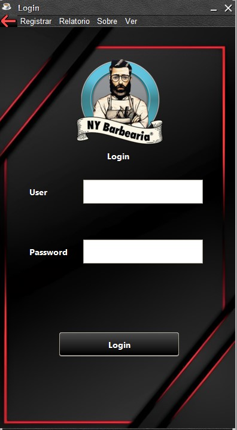
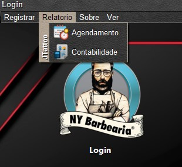
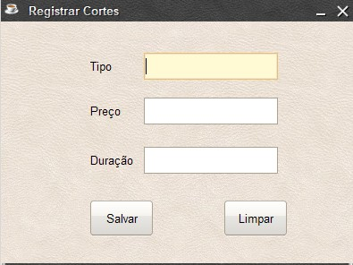
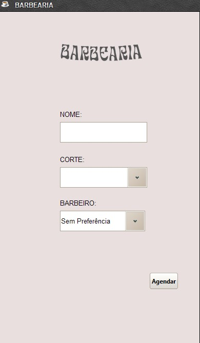
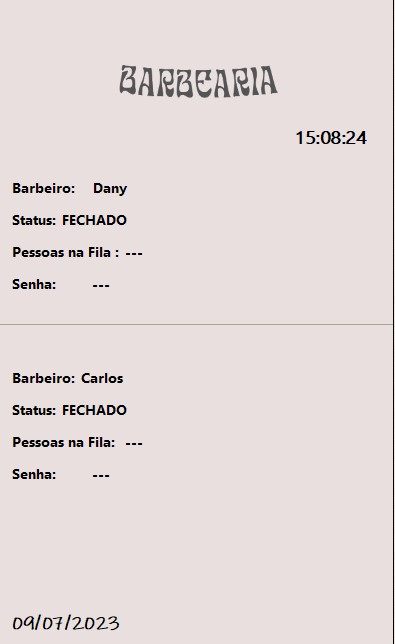
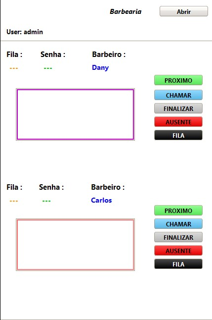

## Capa

- **Universidade Santiago**
- **Departamento de Ciencias da Saude, Ambiente e Tecnologias**
- **Engenharia Informatica**
- **Concepcao e Analise de Algoritmos**

- `Titulo do Trabalho`: 
**Software Gerenciamento de Fila de Atendimento de Barbearia**

- Discentes: [Admilson de Pina](https://github.com/admilsonPina), [Kevin Sousa](https://github.com/Kevin199527), [Amadou Veiga](https://github.com/12q12q12q)

- Docente: Valerio Santos

- Data: `10/07/2023`

## Objetivos

O objetivo deste trabalho é desenvolver um software para gerenciamento de uma fila de atendimento em uma barbearia. 

- Organização e controle dos agendamentos de clientes;
- Priorização dos atendimentos conforme a ordem de chegada;
- Registro dos cortes realizados e custos associados;
- Relatórios de contabilidade e desempenho dos barbeiros.

requisitos_funcionais:

  - O sistema deve permitir o agendamento de clientes para cortes de cabelo.
  - Os clientes devem poder escolher o tipo de corte desejado durante o agendamento.
  - O sistema deve organizar os agendamentos em uma fila de atendimento.
  - O próximo cliente a ser atendido deve ser aquele que está no topo da fila.
  - Os barbeiros devem ter acesso aos detalhes do próximo agendamento a ser atendido.
  - O sistema deve permitir a finalização do atendimento de um cliente, removendo-o da fila.
  - Deve ser possível visualizar a fila de atendimento, mostrando os clientes aguardando e os barbeiros disponíveis.
  - O sistema deve calcular o custo de cada corte de cabelo realizado e registrá-lo.

requisitos_nao_funcionais:

  - O sistema deve ter uma interface intuitiva e fácil de usar para os clientes agendarem os cortes.
  - O tempo de resposta do sistema deve ser rápido, evitando longas esperas.
  - O sistema deve ser capaz de lidar com um grande volume de agendamentos sem comprometer o desempenho.
  - Deve ser possível personalizar as configurações do sistema, como horários de funcionamento da barbearia.
  - O sistema deve ser seguro, protegendo os dados dos clientes e barbeiros.
  - O software deve ser desenvolvido utilizando boas práticas de programação e seguir os padrões de arquitetura MVC.

## Introdução

Este relatório apresenta o desenvolvimento de um sistema de gerenciamento de fila de atendimento de uma barbearia. O software foi implementado seguindo o modelo MVC (Model-View-Controller) e utiliza estruturas de dados como a fila para organizar os agendamentos dos clientes.

## Linguagens e blibliotecas

A implementação do software é 100% em **Java**. 
Usou-se a bliblioteca *Swing* para criar interface. 
A bliblioteca *mysql-connector-j-8.0.33.jar* para a conecção com o sistema de gerenciamento de Base de Dados MySql. 
A bliblioteca *jTattoo* para criar (GUIs) personalizadas.

## Estrutura de Dados

A estrutura de dados principal utilizada no sistema é a fila. A fila é uma estrutura de dados linear que segue a ordem de chegada dos elementos. No contexto da barbearia, a fila é utilizada para organizar os agendamentos dos clientes, garantindo que sejam atendidos na ordem correta.

A implementação da fila foi feita em Java, utilizando classes e métodos específicos para manipulação dos elementos. Foram considerados aspectos como inserção, remoção e consulta de elementos na fila, garantindo o correto funcionamento do sistema.

Além da fila, também foram utilizadas outras estruturas de dados auxiliares, como listas e mapas, para armazenar informações adicionais sobre os barbeiros, clientes e cortes de cabelo.

## Resumo dos Algoritmos

## Pacote modelo

### Agendamento.java
- Descrição: Classe que representa um agendamento de corte de cabelo na barbearia.
- Implementação: A classe possui atributos como cliente, data/hora, tipo de corte, barbeiro, status e senha.

### Barbeiro.java
- Descrição: Classe que representa um barbeiro que realiza cortes de cabelo na barbearia.
- Implementação: A classe possui atributos como nome, telefone e tipoUtilizador que herda do utlizador , alem de acrescentar a Morada , Cni e Especialidade.

### Cliente.java
- Descrição: Classe que representa um cliente que deseja agendar um corte de cabelo na barbearia.
- Implementação: A classe possui atributos como nome nome, telefone e tipoUtilizador que herda do utlizador alem do TipoCliente que e da classe.

### Cortes.java
- Descrição: Classe que representa um tipo de corte de cabelo disponível na barbearia.
- Implementação: A classe possui atributos como tipo de corte, duração e preço.

### No.java
- Descrição: Classe que representa um nó da fila de atendimento.
- Atributos: agendamento, proximo.

### Sistema.java
- Descrição: Classe  que controla a autenticacao do sistema de gerenciamento da fila de atendimento da barbearia.
- Implementação: A classe possui atributos como username e password para controle de autenticacao.

### Utilizador.java
- Descrição: Classe que representa um utilizador do sistema, como cliente ou barbeiro.
- Implementação: A classe possui atributos como nome,telefone e tipoUtilizador relacionados ao utilizador.

### Analise da Complexidade
- As classes do pacote modelo em geral tem um grau de complexidade baixo, pois se limitam principalmente a definicão de atributos e construtores.

## Pacote Controle
### BaseDeDados.Java,
    - Classe Base de dados responsável por realizar operações no banco de dados.

  - Complexidade dos principais algoritmos implementados:

-Método `conectar()`:
  - Complexidade: O(1)
  - Descrição: Estabelece a conexão com o banco de dados utilizando os parâmetros de URL, usuário e senha.

Método `desconectar()`:
  - Complexidade: O(1)
  - Descrição: Encerra a conexão com o banco de dados.

Método `inserirSistema(Sistema sistema)`:
  - Complexidade: O(1)
  - Descrição: Insere um objeto Sistema no banco de dados.

Método `atualizarSistema(Sistema sistema)`:
  - Complexidade: O(1)
  - Descrição: Atualiza um objeto Sistema no banco de dados.

Método `autenticarSistema(String username, String password)`:
  - Complexidade: O(1)
  - Descrição: Autentica um sistema no banco de dados utilizando o nome de usuário e senha fornecidos.

Método `inserirUtilizador(Utilizador utilizador)`:
  - Complexidade: O(1)
  - Descrição: Insere um objeto Utilizador no banco de dados e retorna o ID gerado.

Método `inserirCliente(Cliente cliente)`:
  - Complexidade: O(1)
  - Descrição: Insere um objeto Cliente no banco de dados, inserindo também um Utilizador correspondente.

Método `inserirBarbeiro(Barbeiro barbeiro)`:
  - Complexidade: O(1)
  - Descrição: Insere um objeto Barbeiro no banco de dados, inserindo também um Utilizador correspondente.

Método `atualizar(Utilizador utilizador)`:
  - Complexidade: O(1)
  - Descrição: Atualiza um objeto Utilizador no banco de dados.

Método `atualizarCliente(Cliente cliente)`:
  - Complexidade: O(1)
  - Descrição: Atualiza um objeto Cliente no banco de dados.

Método `atualizarBarbeiro(Barbeiro barbeiro)`:
  - Complexidade: O(1)
  - Descrição: Atualiza um objeto Barbeiro no banco de dados.

Método `removerCliente(int idCliente)`:
  - Complexidade: O(1)
  - Descrição: Remove um cliente do banco de dados, juntamente com o correspondente Utilizador.

Método `removerBarbeiro(int idBarbeiro)`:
  - Complexidade: O(1)
  - Descrição: Remove um barbeiro do banco de dados, juntamente com o correspondente Utilizador.

Método `listarBarbeiros()`:
  - Complexidade: O(n)
  - Descrição: Retorna uma lista de objetos Barbeiro existentes no banco de dados.

Método `listarClientes()`:
  - Complexidade: O(n)
  - Descrição: Retorna uma lista de objetos Cliente existentes no banco de dados.

Método `pesquisarPorId(int id)`:
  - Complexidade: O(1)
  - Descrição: Pesquisa um objeto Utilizador no banco de dados com base no ID fornecido.

Método `pesquisarPorNome(String nome)`:
  - Complexidade: O(n)
  - Descrição: Pesquisa uma lista de objetos Utilizador no banco de dados com base no nome fornecido.

Método `pesquisarClientePorNome(String nome)`:
  - Complexidade: O(n)
  - Descrição: Pesquisa uma lista de objetos Cliente no banco de dados com base no nome fornecido.

Método `pesquisarBarbeiroPorNome(String nome)`:
  - Complexidade: O(n)
  - Descrição: Pesquisa uma lista de objetos Barbeiro no banco de dados com base no nome fornecido.

Método `adicionarCorte(Cortes corte)`:
  - Complexidade: O(1)
  - Descrição: Adiciona um objeto Corte ao banco de dados.

Método `listarCortes()`:
  - Complexidade: O(n)
  - Descrição: Retorna uma lista de objetos Cortes existentes no banco de dados.

Método `pesquisarCortePorNome(String nomeCorte)`:
  - Complexidade: O(1)
  - Descrição: Pesquisa um objeto Corte no banco de dados com base no nome do corte fornecido.

Método `getClienteId(Cliente cliente)`:
  - Complexidade: O(1)
  - Descrição: Retorna o ID de um cliente no banco de dados com base no objeto Cliente fornecido.

Método `getCorteId(Cortes corte)`:
  - Complexidade: O(1)
  - Descrição: Retorna o ID de um corte no banco de dados com base no objeto Corte fornecido.

Método `getBarbeiroId(Barbeiro barbeiro)`:
  - Complexidade: O(1)
  - Descrição: Retorna o ID de um barbeiro no banco de dados com base no objeto Barbeiro fornecido.

Método `inserirAgendamento(Agendamento agendamento)`:
  - Complexidade: O(1)
  - Descrição: Insere um objeto Agendamento no banco de dados, juntamente com os objetos relacionados.

Método `consultarAgendamentosPorData(LocalDate data)`:
  - Complexidade: O(n)
  - Descrição: Retorna uma lista de objetos Agendamento do banco de dados com base em uma data específica.

Método `consultarAgendamentosFinalizadosPorBarbeiro(LocalDate data)`:
  - Complexidade: O(n)
  - Descrição: Retorna um mapa contendo o nome dos barbeiros e o total de valores arrecadados em agendamentos finalizados em uma determinada data.

Método `atualizarStatusAgendamento(int idAgendamento, String novoStatus)`:
  - Complexidade: O(1)
  - Descrição: Atualiza o status de um agendamento no banco de dados com base no ID fornecido.

Método `getIdAgendamento(Agendamento agendamento)`:
  - Complexidade: O(1)
  - Descrição: Retorna o ID de um agendamento no banco de dados com base no objeto Agendamento fornecido.

### FilaAtendimento.java
 
    - A classe `FilaAtendimento` implementa uma fila de atendimento utilizando a estrutura de dados de fila (FIFO - First In, First Out). Ela armazena objetos do tipo `Agendamento` em nós ligados, permitindo a inserção de elementos no final da fila e a remoção do elemento que está no início da fila.

Principais métodos da classe:

- `FilaAtendimento()`: Construtor da classe. Inicializa os atributos `inicio` e `fim` como nulos e define o tamanho da fila como 0.

- `getTamanho()`: Retorna o tamanho atual da fila.

- `getFim()`: Retorna o nó final da fila.

- `getPrimeiroAgendamento()`: Retorna o agendamento do primeiro nó da fila.

- `getUltimoAgendamento()`: Retorna o agendamento do último nó da fila.

- `isEmpty()`: Verifica se a fila está vazia.

- `enqueue(Agendamento agendamento)`: Insere um novo agendamento no final da fila.

- `dequeue()`: Remove e retorna o agendamento do início da fila.

- `exibirFila()`: Exibe os nomes dos clientes presentes na fila.

- `atualizarTamanho()`: Atualiza o tamanho da fila.

- `getAgendamentos()`: Retorna uma lista contendo todos os agendamentos presentes na fila.

Análise da Complexidade dos Principais Algoritmos:

- `getTamanho()`, `getFim()`, `getPrimeiroAgendamento()`, `getUltimoAgendamento()`, `isEmpty()`, `exibirFila()`, `atualizarTamanho()`, `getAgendamentos()`: Esses métodos têm complexidade O(1), pois realizam apenas operações de acesso direto aos atributos ou percorrem todos os elementos da fila uma vez.

- `enqueue(Agendamento agendamento)`: Tem complexidade O(1), pois apenas atualiza o nó final da fila.

- `dequeue()`: Tem complexidade O(1), pois remove o nó do início da fila e atualiza o nó inicial.

A classe `FilaAtendimento` possui uma implementação eficiente para as operações de inserção, remoção e acesso aos elementos da fila.

### Barbearia.java

    - A classe `Barbearia` representa uma barbearia no sistema de controle. Ela possui os seguintes atributos:
    - `filas`: Um `HashMap` que mapeia cada `Barbeiro` com sua respectiva `FilaAtendimento`. Armazena as filas de atendimento de cada barbeiro da barbearia.
    - `senhas`: Um `Map` que mapeia cada `Barbeiro` com a senha atual. Armazena as senhas dos barbeiros.
    - `agendamentosFinalizados`: Uma lista de `Agendamento` que armazena os agendamentos que foram finalizados.

Método `agendarCliente(Cliente cliente, LocalDateTime dataHora, Cortes corte, Barbeiro barbeiro, String status, String senha)`:
  - Complexidade: O(1)
  - Descrição: Agenda um cliente para um determinado horário, corte, barbeiro e status. Gera uma senha para o agendamento, adiciona-o à fila de atendimento do barbeiro correspondente e insere o agendamento na base de dados.

Método `receberAgendamento(Agendamento agendamento, Barbeiro barbeiro)`:
  - Complexidade: O(1)
  - Descrição: Recebe um agendamento e o adiciona à fila de atendimento do barbeiro correspondente.

Método `atenderProximoCliente(Barbeiro barbeiro)`:
  - Complexidade: O(1)
  - Descrição: Atende o próximo cliente da fila de atendimento do barbeiro especificado. Remove o agendamento da fila e retorna o objeto `Agendamento` correspondente.

Método `exibirFila(Barbeiro barbeiro)`:
  - Complexidade: O(1)
  - Descrição: Exibe a fila de atendimento do barbeiro especificado.

Método `limparFila(Barbeiro barbeiro)`:
  - Complexidade: O(1)
  - Descrição: Limpa a fila de atendimento do barbeiro especificado, removendo o primeiro agendamento da fila. Exibe os detalhes do agendamento finalizado e atualiza a lista de agendamentos finalizados.

Método `getFila(Barbeiro barbeiro)`:
  - Complexidade: O(1)
  - Descrição: Retorna a fila de atendimento do barbeiro especificado.

Método `getTamanho(Barbeiro barbeiro)`:
  - Complexidade: O(1)
  - Descrição: Retorna o tamanho da fila de atendimento do barbeiro especificado.

Método `atualizarTamanhoFila(Barbeiro barbeiro)`:
  - Complexidade: O(1)
  - Descrição: Atualiza o tamanho da fila de atendimento do barbeiro especificado.

Método `getUltimoAgendamento(Barbeiro barbeiro)`:
  - Complexidade: O(1)
  - Descrição: Retorna o último agendamento da fila de atendimento do barbeiro especificado.

Método `getPrimeiroAgendamento(Barbeiro barbeiro)`:
  - Complexidade: O(1)
  - Descrição: Retorna o primeiro agendamento da fila de atendimento do barbeiro especificado.

Método `temSenha(Barbeiro barbeiro)`:
  - Complexidade: O(1)
  - Descrição: Verifica se há uma senha definida para o barbeiro especificado.

Método `inicializarSenha(Barbeiro barbeiro)`:
  - Complexidade: O(1)
  - Descrição: Inicializa a senha para o barbeiro especificado, definindo o valor padrão como 1.

Método `getSenhaAtual(Barbeiro barbeiro)`:
  - Complexidade: O(1)
  - Descrição: Retorna a senha atual do barbeiro especificado, formatada de acordo com o padrão.

Método `incrementarSenha(Barbeiro barbeiro)`:
  - Complexidade: O(1)
  - Descrição: Incrementa a senha atual do barbeiro especificado.

Método `gerarSenhaFormatada(int senha, Barbeiro barbeiro)`:
  - Complexidade: O(1)
  - Descrição: Gera uma senha formatada com base no número da senha e no nome do barbeiro.

Método `getBarbeiroComMenorHorario()`:
  - Complexidade: O(n)
  - Descrição: Retorna o `Barbeiro` com o menor horário de agendamento. Percorre as filas de atendimento de cada barbeiro e verifica qual possui o primeiro agendamento com o menor horário.

## Pacote modoConsola

### TesteBarbearia

A classe `TesteBarbearia` do pacote `modoConsola` é responsável por simular a interação do utilizador com o sistema de uma barbearia por meio do console. Ela realiza o agendamento de cortes de cabelo para os clientes, exibindo informações relevantes sobre os cortes disponíveis, barbeiros e a fila de atendimento.

O teste começa verificando se existem barbeiros disponíveis no sistema. Caso não haja barbeiros cadastrados, a execução é encerrada. Em seguida, entra em um loop que permite agendar cortes para os clientes.

1. Solicitação do nome do cliente:
   - O utilizador insere o nome do cliente pelo console.

2. Pesquisa pelo cliente:
   - O sistema verifica se o cliente já está registrado no sistema com base no nome fornecido.
   - Se houver apenas um cliente encontrado, ele é selecionado automaticamente.
   - Se houver mais de um cliente com o mesmo nome, é exibida uma lista para escolha do cliente desejado.
   - Se o cliente não estiver registrado, o sistema solicita informações adicionais para registrar um novo cliente.

3. Listagem dos cortes disponíveis:
   - O sistema exibe a lista de cortes disponíveis, mostrando o tipo de corte, custo e duração.

4. Seleção do corte desejado:
   - O utilizador seleciona o número correspondente ao corte desejado.

5. Listagem dos barbeiros disponíveis:
   - O sistema exibe a lista de barbeiros disponíveis, mostrando o número, nome e especialidade.

6. Seleção do barbeiro desejado:
   - O utilizador seleciona o número correspondente ao barbeiro desejado.

7. Agendamento do corte:
   - O sistema agenda o corte selecionado para o cliente, utilizando a data e hora atual como exemplo.
   - Se for o primeiro agendamento para o barbeiro selecionado, o próximo horário é definido como a data e hora atual somada à duração do corte.
   - Caso contrário, o próximo horário é calculado a partir do horário do último agendamento e da duração do corte.
   - O agendamento é registrado na barbearia e exibido um ticket de marcação com as informações relevantes.

8. Exibição da fila de atendimento:
   - O sistema exibe a fila de atendimento do barbeiro selecionado, atualizando o tamanho da fila.

9. Continuidade do agendamento:
   - O sistema pergunta ao utilizador se deseja realizar outro agendamento. Se a resposta for "S" (sim), o loop continua. Caso contrário, o teste é encerrado.

O teste utiliza a classe `Barbearia` para realizar as operações de agendamento e manipulação das filas de atendimento. A classe `BaseDeDados` é utilizada para obter informações dos barbeiros, clientes e cortes disponíveis.

Complexidade do algoritmo:

- O loop principal do teste executa até que o utilizador não queira realizar mais agendamentos, portanto, sua complexidade depende do número de agendamentos realizados.
- As operações de pesquisa e seleção de clientes e cortes têm complexidade O(n), onde n é o número de clientes ou cortes encontrados.
- A exibição da fila de atendimento possui complexidade O(m), onde m é o tamanho da fila do barbeiro selecionado.
- As demais operações, como agendar cliente, atualizar tamanho da fila, obter último agendamento, entre outras, têm complexidade O(1).

## Interface

### Login

A classe `Login` é responsável por criar a tela de login de um sistema de barbearia. Ela possui diversos componentes gráficos, como labels, text fields, buttons, menus, entre outros, que permitem ao usuário interagir com o sistema.

O funcionamento da classe é dividido em dois principais aspectos: a autenticação do usuário e a navegação nas funcionalidades do sistema.

### Autenticação do usuário

Ao clicar no botão de login (`btnLogin`), a classe captura o nome de usuário e a senha inseridos nos campos correspondentes (`txtNome` e `PassWSenha`, respectivamente). Em seguida, verifica se os campos estão vazios e exibe uma mensagem de erro caso necessário.

Caso os campos não estejam vazios, a classe chama o método `autenticarSistema` da classe `BaseDeDados` para verificar se as credenciais do usuário são válidas. Se as credenciais estiverem corretas, o usuário é redirecionado para a tela principal do sistema (`TelasBarbearia`).

### Navegação nas funcionalidades

A classe possui diversos eventos associados a botões e itens de menu que permitem a navegação nas diferentes funcionalidades do sistema. Por exemplo:

- Ao clicar no item de menu "Cortes" (`MenuItemCortes`), é aberta uma nova janela onde o usuário pode registrar os dados de um novo corte.

- Ao clicar no item de menu "Barbeiro" (`MenuItemBarbeiro`), é aberta uma nova janela onde o usuário pode cadastrar um novo barbeiro.

- Ao clicar no item de menu "Agendamento" (`MenuItemAgendamento`), é exibida uma caixa de diálogo onde o usuário pode escolher entre consultar os agendamentos do dia ou em uma data específica.

- Ao clicar no item de menu "Contabilidade" (`MenuItemContabilidade`), é exibida uma caixa de diálogo onde o usuário pode escolher entre consultar a contabilidade do dia ou em uma data específica.

- Ao clicar no item de menu "Tipos de Cortes" (`MenuItemtiposDeCorte`), é exibida uma tabela com os tipos de cortes registrados no sistema.

Outras funcionalidades, como exibir informações sobre a barbearia e o software, também estão disponíveis por meio dos itens de menu correspondentes.

## Descrição dos Algoritmos e Uso dos Objetos Java

A classe `Login` faz uso de diversos objetos do Java para criar a interface gráfica e implementar as funcionalidades do sistema. Abaixo, estão descritos alguns dos objetos utilizados:

- `JFrame`: É uma classe que representa uma janela na interface gráfica. A classe `Login` herda de `JFrame` para criar a janela de login.

- `JLabel`: É uma classe que exibe um texto ou uma imagem na interface gráfica. É utilizada para exibir labels como "Login", "Password", etc.

- `JTextField`, `JPasswordField`: São classes que permitem ao usuário inserir texto na interface gráfica. São utilizadas para capturar o nome de usuário e senha.

- `JButton`: É uma classe que representa um botão na interface gráfica. É utilizada para criar botões como "Login", "Salvar", etc.

- `JMenuBar`, `JMenu`, `JMenuItem`: São classes que permitem criar barras de menu com itens clicáveis. São utilizadas para criar o menu da aplicação e as opções disponíveis.

- `JPanel`: É uma classe que representa um painel na interface gráfica. É utilizada para agrupar componentes e organizar a interface.

- `JOptionPane`: É uma classe que exibe caixas de diálogo na interface gráfica. É utilizada para exibir mensagens de erro, solicitar dados do usuário, entre outros.

- `BaseDeDados`: É uma classe que representa a base de dados do sistema. É utilizada para autenticar o usuário, cadastrar barbeiros, registrar cortes, consultar agendamentos, entre outras operações.

- Outros objetos como `ImageIcon`, `Font`, `Cursor`, `BufferedImage`, `CircularPanel`, `JScrollPane`, `JTable`, etc., são utilizados para personalizar a interface gráfica e fornecer funcionalidades específicas.

## Análise da Complexidade dos Principais Algoritmos

A complexidade dos algoritmos na classe `Login` depende principalmente das operações realizadas em cada evento. Abaixo, são descritos os principais algoritmos e sua complexidade aproximada:

- Autenticação do usuário (`actionPerformed` com `btnLogin`):
  - A complexidade é O(1), pois envolve apenas operações de verificação e chamadas de método na classe `BaseDeDados`.

- Registro de cortes (`actionPerformed` com `MenuItemCortes`):
  - A complexidade é O(1), pois envolve apenas a exibição de uma nova janela e o registro dos dados do corte na classe `BaseDeDados`.

- Cadastro de barbeiro (`actionPerformed` com `MenuItemBarbeiro`):
  - A complexidade é O(1), pois envolve apenas a exibição de uma nova janela e o cadastro dos dados do barbeiro na classe `BaseDeDados`.

- Consulta de agendamentos (`actionPerformed` com `MenuItemAgendamento`):
  - A complexidade depende da opção selecionada pelo usuário:
    - Agendamentos do dia: A complexidade é O(n), onde n é o número de agendamentos do dia. Isso ocorre porque é necessário consultar os agendamentos por data na classe `BaseDeDados` e exibir os resultados em uma caixa de diálogo.
    - Agendamentos em data específica: A complexidade é O(n), onde n é o número de agendamentos na data especificada. Isso ocorre porque é necessário consultar os agendamentos por data na classe `BaseDeDados` e exibir os resultados em uma caixa de diálogo.

- Consulta de contabilidade (`actionPerformed` com `MenuItemContabilidade`):
  - A complexidade depende da opção selecionada pelo usuário:
    - Contabilidade do dia: A complexidade é O(n), onde n é o número de agendamentos finalizados no dia. Isso ocorre porque é necessário consultar os agendamentos finalizados por barbeiro na classe `BaseDeDados` e exibir os resultados em uma caixa de diálogo.
    - Contabilidade em data específica: A complexidade é O(n), onde n é o número de agendamentos finalizados na data especificada. Isso ocorre porque é necessário consultar os agendamentos finalizados por barbeiro na classe `BaseDeDados` e exibir os resultados em uma caixa de diálogo.

- Exibição de tipos de cortes (`actionPerformed` com `MenuItemtiposDeCorte`):
  - A complexidade é O(m), onde m é o número de tipos de cortes registrados na base de dados. Isso ocorre porque é necessário consultar os tipos de cortes na classe `BaseDeDados` e exibir os resultados em uma tabela.

É importante ressaltar que a complexidade descrita acima é uma estimativa aproximada e pode variar dependendo da implementação detalhada de cada método na classe `BaseDeDados` e de outras classes auxiliares utilizadas.

Além disso, é necessário considerar que a classe `Login` também possui métodos auxiliares, como `autenticarUser`, `Barbero`, `Corte`, `exibirAgendamentos` e `exibirRelatorioContabilidade`, que não foram analisados individualmente, mas contribuem para o funcionamento do sistema.

## Interface (Login e Telas Barbearia):
  
  - Descrição da interface:
    - A interface de Login é responsável por exibir a tela de login, onde o usuário pode inserir seu nome de usuário e senha para autenticação no sistema. Ela apresenta campos de texto para inserção dos dados e botões para realizar o login. Além disso, possui menus com opções de registro, relatório e informações sobre o sistema.

    - A interface das Telas Barbearia é responsável por exibir a tela principal do sistema após o login bem-sucedido. Ela apresenta uma interface gráfica mais abrangente, com menus que permitem . 
    Também possui campos de texto, botões e tabelas para interação com o usuário.

  - Funcionalidades disponibilizadas ao utilizador:
    - Na interface de Login:

      - Inserir nome de usuário e senha para autenticação no sistema.
      - Realizar o login através do botão de login.
      .

      - Acesso a menus de registro, relatório e informações sobre o sistema.
      .

      - Cadastrar barbeiros com nome, contato, CNI, morada e especialidade.
      .

      - Cadastrar cortes com tipo, preço e duração.
      .

    

      - Consultar agendamentos por data e exibir em uma tabela.
      - Consultar a contabilidade por data ou dia atual e exibir em uma caixa de diálogo.
      - Exibir os tipos de cortes cadastrados em uma tabela.
      - Acesso a informações sobre a barbearia e o software utilizado.

  - Demonstração da interface (Telas Barbearia):

    
    
    

## Resultados e Conclusões:

  O software de gestão de fila de barbearia desenvolvido apresentou os seguintes resultados e conclusões:

  - Organização e eficiência: O software proporcionou uma melhor organização e eficiência no gerenciamento da fila de atendimento em uma barbearia. Com as funcionalidades de cadastro de barbeiros, tipos de cortes e agendamentos, foi possível otimizar o fluxo de trabalho e garantir um atendimento mais ágil e satisfatório para os clientes.

  - Controle de agendamentos: O sistema permitiu o agendamento de cortes, possibilitando aos clientes escolherem o barbeiro, o tipo de corte  desejada. Isso contribuiu para uma melhor distribuição dos serviços ao longo do dia e evitou o acúmulo de clientes em desoorganizando a fila.

  - Relatórios e informações: A geração de relatórios permitiu a análise dos dados relacionados aos agendamentos, contabilidade e tipos de cortes. Essas informações foram úteis para o acompanhamento do desempenho da barbearia, a tomada de decisões estratégicas e a identificação de oportunidades de melhoria.

  - Experiência do utilizador: A interface amigável e intuitiva do software proporcionou uma experiência agradável para os usuários, facilitando o uso e a navegação entre as funcionalidades. Isso contribuiu para a adoção do software pelos colaboradores da barbearia e para a satisfação dos clientes.

  - Resultados positivos: A implementação do software de gestão de fila de barbearia resulta em uma maior eficiência operacional, redução de erros e melhor controle do atendimento ao cliente. Isso impacta positivamente a reputação da barbearia e a fidelização dos clientes.

  Em suma, o software de gestão de fila de barbearia demonstrou ser uma solução eficaz para otimizar os processos internos, melhorar o atendimento aos clientes e proporcionar uma experiência mais satisfatória para todos os envolvidos.

## Referências:
  - JTattoo: <http://www.jtattoo.net/Download.html>
  - Conector MySQL em Java: <https://dev.mysql.com/downloads/connector/j/>

